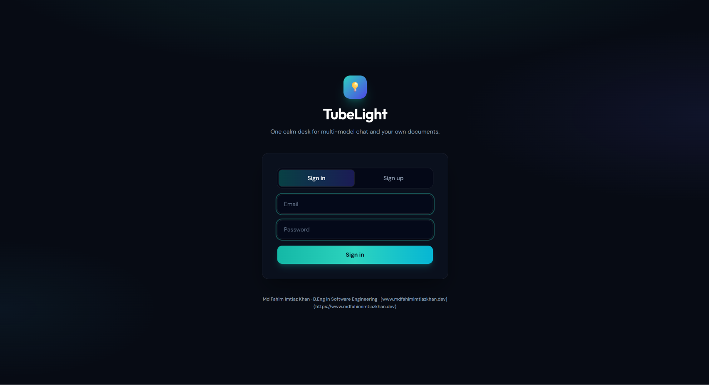
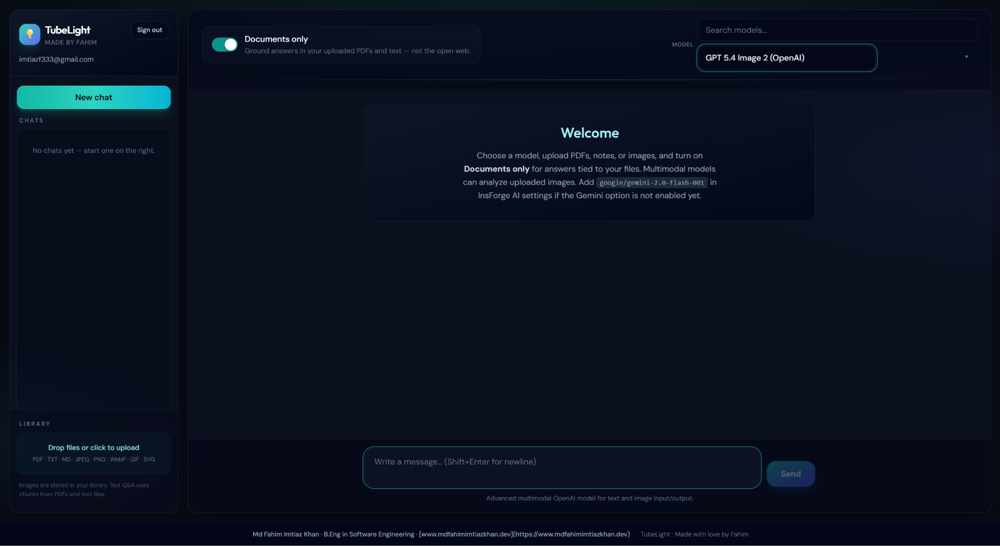
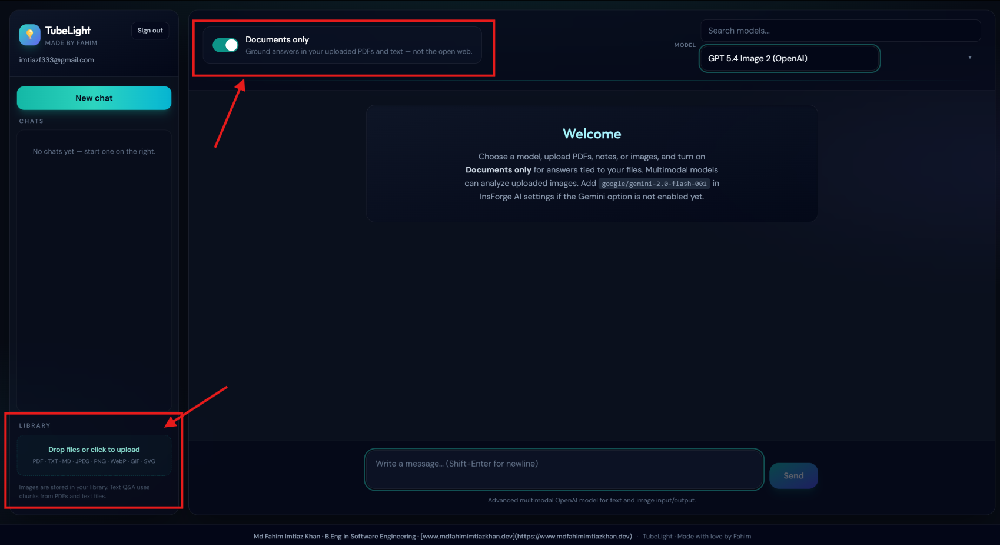
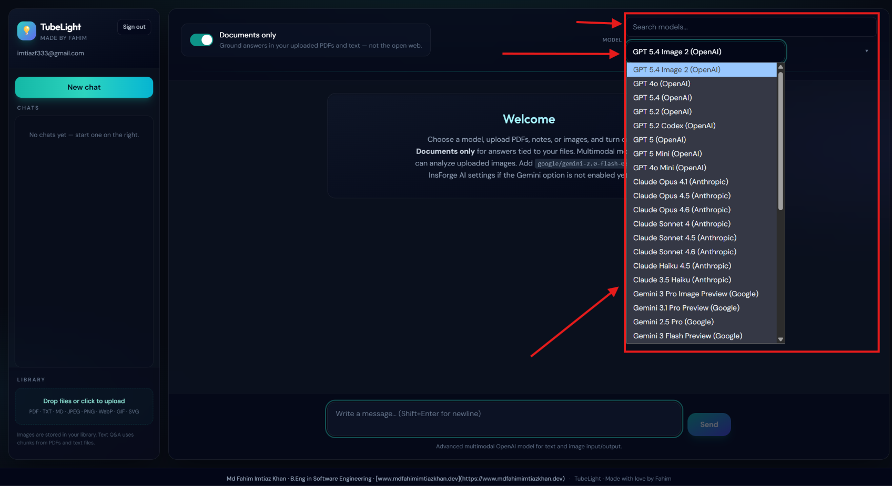

# 🚀 TubeLight — Your Desk Lamp for Ideas ✨

<p align="center">
  
  
  
  
  
  
</p>

<p align="center">
  <strong>A calm, personal, multimodal AI workspace.</strong><br>
  Chat with frontier models • Ground answers in your own documents • Private image library • Powered by InsForge
</p>

---

<div align="center">
  
  
</div>

---

<div align="center">

**TubeLight** is a beautiful, distraction-free web app that turns InsForge into your personal AI thinking companion.  
Think of it as a **soft tube light glowing over your late-night desk** — focused, warm, and always ready to help you explore ideas.

## ⭐ [Star this repo](https://github.com/fahimimtiaz12/TubeLight)

</div>

---

# ✨ Features

| Feature | Description |
|---|---|
| 🔐 **Secure Personal History** | Private chats scoped only to you |
| 🌐 **Multi-Model Switching** | GPT-4o mini, Claude 3.5 Sonnet, Gemini & more |
| 📄 **Document RAG** | Ask smart questions grounded in your own PDFs, Markdown & text files |
| ⚡ **Fast & Beautiful UI** | Modern, clean and responsive design with Tailwind CSS |

Built for **learners, builders, researchers, writers, and solo creators** who want one peaceful place to think deeply with AI.

---

# 📸 Screenshots & Demo

<div align="center">

## 🔐 Login / Sign Up


---

## 💬 Chat Interface


---

## 📄 Document Upload


---

## 🤖 Model Switcher


</div>

---

# 👤 Author & Connect

## **Md Fahim Imtiaz Khan**
*B.Eng in Software Engineering*

- 🌐 **Portfolio** → [mdfahimimtiazkhan.dev](https://mdfahimimtiazkhan.dev/)
- 💻 **GitHub** → [@fahimimtiaz12](https://github.com/fahimimtiaz12)

---

# 🚀 Quick Start (Local Development)

## 📋 Prerequisites

Make sure you have the following installed:

- **Node.js 20+** (recommended)
- **npm**
- An **InsForge project** (free tier works great)

---

# ⚙️ Step-by-Step Setup

## 1️⃣ Link Your InsForge Project

```bash
npx @insforge/cli login
npx @insforge/cli link
```

---

## 2️⃣ Set Up Environment Variables

```bash
cp .env.example .env
```

---

## 3️⃣ Install Dependencies

```bash
npm install
```

---

## 4️⃣ Start Development Server

```bash
npm run dev
```

Open your browser and visit:

```txt
http://localhost:5173
```

---

## 💡 Important Tip

Add the following URL to **Allowed Auth Redirects** inside your InsForge dashboard:

```txt
http://localhost:5173
```

---

# 🗄️ Database & Storage

This uses **4 main tables** automatically created by the migrations:

| Table | Purpose |
|---|---|
| `tubelight_chats` | Stores chat sessions and metadata |
| `tubelight_messages` | Individual messages in each chat |
| `tubelight_chunks` | Document chunks with vector embeddings (powers RAG) |
| `tubelight_document_sources` | Metadata of uploaded documents (PDFs, etc.) |

---

## 🔒 Security

- Row-Level Security (**RLS**) is enabled
- Every user can only access their own data
- All documents and images are stored in the private bucket:

```txt
tubelight-docs
```

Everything is **private by default** — only the signed-in user can access their data.

---

# 🌍 Deploy to Production

## Build the project

```bash
npm run build
```

## Deploy using InsForge CLI

```bash
npx @insforge/cli deployments deploy .
```

---

# 🛠️ Tech Stack

| Layer | Technology |
|---|---|
| Frontend | Vite + React + TypeScript + Tailwind CSS |
| Backend | InsForge (Auth • Postgres • Vector Search • Storage • AI Gateway) |

---

# 📜 License

MIT License — Free to use, modify, and build upon.

---

# 🤝 Contributing

We welcome contributions of all sizes!

Please read our **Contributing Guide** first before submitting pull requests or issues.

---

# 🌟 About TubeLight

> **TubeLight — crafted with care — 2026 🌟**  
> Your calm corner of the internet for thinking with AI.

Made with ❤️ by **Md Fahim Imtiaz Khan**

---

# 💬 Final Note

Happy building & thinking!

If you have any questions, feel free to open an issue or reach out directly — I’d love to help you customize TubeLight for your workflow.

## ⭐ If you like this project, please star the repo!
It helps others discover TubeLight and supports the project.

---

<div align="center">

### 🚀 TubeLight
### Your Desk Lamp for Ideas ✨

</div>